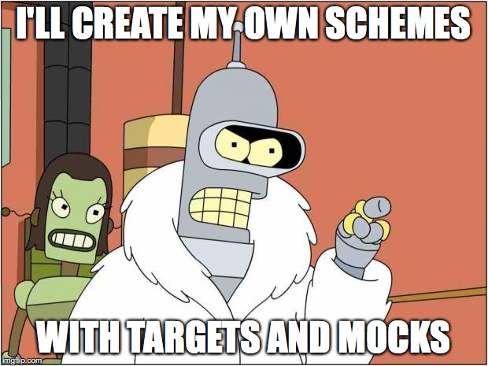
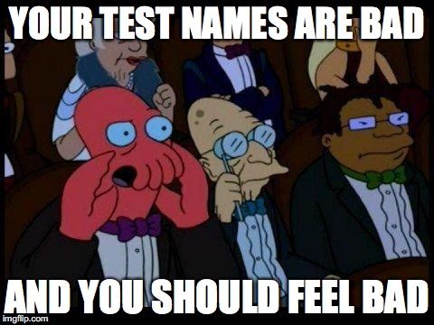

# Testing with Xcode

^ Present yourself

^ Present Macforum and Inserve

^ Talk about cocoaheads

---

## Do you write tests?

---


---

### Why write tests?

^ Document code

^ Trust in code

^ Forces you to think about the code

---

## Test Driven Development

^ Write test -> Red -> Green -> Refactor

---

### unit tests 

### integration tests

### UI tests

^ Will not talk about UI Testing that much

---

### Singel responsobility

### Dependecy injection

### Protocols

^ Not talk about testable code

^ But this is what I use and maybe that should be a diffrent talk

---

#Xcode
###XCTest & XCUITest

---

# Test coverage

If you like it then you should have put a test on it

^ Test coverage only means that code has run and is maybe not useless

^ Show how to activate test coverage and how it looks

---

## Run all target tests
*cmd - u*

## Run last test or tests
*ctrl + cmd + alt - G*

---



^ Show the test targets and how they can be used to make test better

^ You don't wanna run all tests everytime

---



---

## Understand test from name

```swift
// Structure
func testMethodName_WithCertainState_ShouldDoSomething() {...}

// Example
func testDescription_WordWithNoInserts_ShouldGiveStringWithUnderscoresSeperatedWithSpaces() {...}
```
---

## Structure

```swift
    func testGuess_NoGuesses_WrongGuessShouldDecreseTries() {
        // Setup
        let word = Word(string: "Drake")
        var hangman = Hangman(word: word, tries: 10)
        
        // Exercise
        hangman.guess("t")
        
        //Verify
        XCTAssertEqual(hangman.tries, 9)
    }
```
---

## Helping methods

```swift
    func testGuess_NoGuesses_WrongGuessShouldDecreseTries() {
        ...
        helper()
        ...
    }

    func helper(file: String = #file, line: UInt = #line) {
    	...
        XCTAssertTrue(aStatement, "Wrong in helter", file: #file, line:  line)
    }
```

---

## Testing View controllers 

---

# Setup View Controller for tests

```swift
class AViewControllerTests: XCTestCase {
    
    var viewController: UIViewController!
    
    override func setUp() {
        super.setUp()
    
        let storyboard = UIStoryboard(name: storyboardIdentifier, bundle: NSBundle.mainBundle())
    	viewController = storyboard.instantiateViewControllerWithIdentifier(viewControllerIdentifier)

        viewController.hangman = Hangman(word: Word(string: "test"), tries: 5)
        
        UIApplication.sharedApplication().keyWindow!.rootViewController = viewController
        
        XCTAssertNotNil(viewController.view)
    }
```

---

# Testing Outlets

```swift
    func testLabel_ShouldBeConnected() {
        XCTAssertNotNil(viewController.label)
    }
```

---

# Testing Target Actions

```swift
func testButton_ShouldHaveAction() {
    let actions = viewController.button.actionsForTarget(viewController, forControlEvent: UIControlEvents.TouchUpInside)
    
    XCTAssertEqual(actions?.count, 1)
    XCTAssertEqual(actions![0], "buttonAction")
}
```

---

Credits:

Natasha The Robot - https://www.natashatherobot.com

Jon Reid - http://qualitycoding.org
